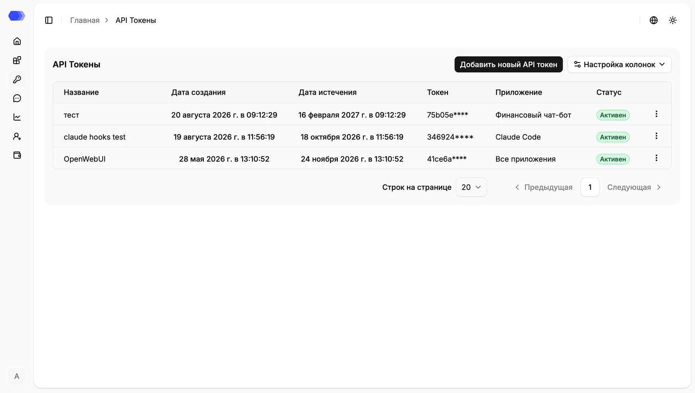
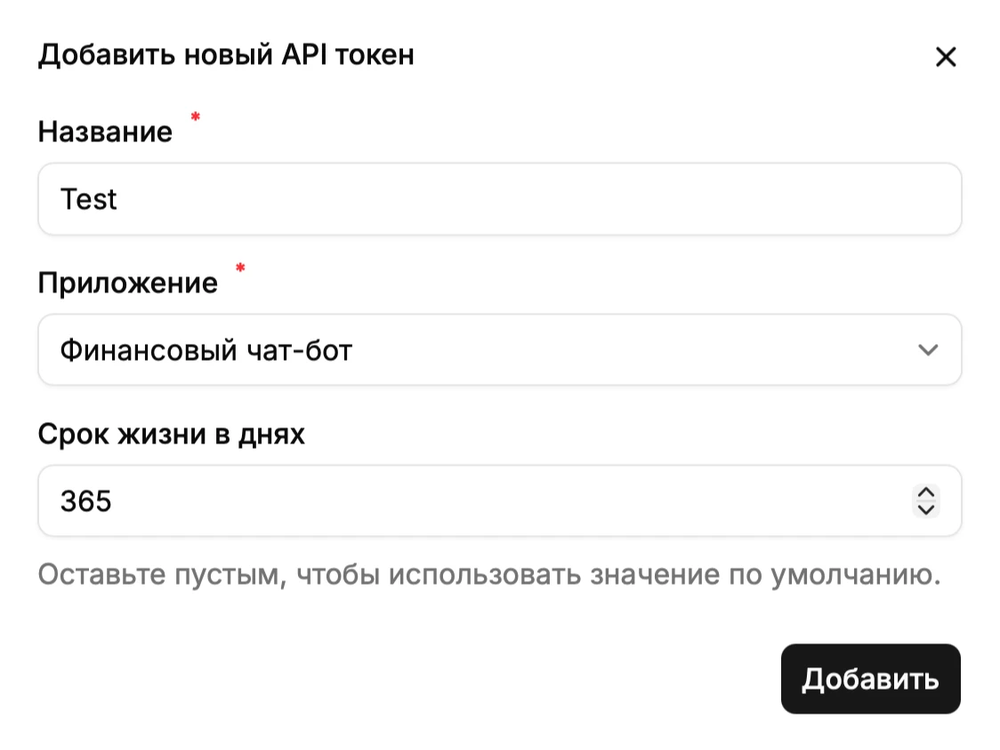

API tokens authorize SDK and direct API integrations. A token value is displayed only once after creation.

## API-token table

- **Name** — human-readable purpose of the token.
- **Created at** — issue time.
- **Expires at** — time after which authentication fails.
- **Token** — safe shortened preview; the full secret is never shown in the table.
- **Application** — the assigned application, or **All applications** for a legacy token.
- **Status** — `Active` or `Inactive`.
- **Row menu** — deletes the selected token after confirmation.

**Column settings** hides or restores columns. **Rows per page**, **Previous**, and **Next** control pagination.

## Create a token

Select **Add new API token** and provide:

- **Name** — required purpose of the token;
- **Application** — required scope selected from existing applications;
- **Lifetime in days** — optional positive integer from 1 to 3,650. Leaving it blank uses the server default.

Select **Add**, then copy the generated token from the next dialog and store it in a secrets manager. Its full value cannot be recovered after the dialog closes.

## Application scope

HiveTrace 4.3 scopes every newly created token to one application; the request `application_id` must match it.

Tokens created **before upgrading to 4.3** can display **All applications** and have `application_id = null`. They remain visible for backward compatibility, but the 4.3 interface cannot create another token with this scope. Replace each legacy token with separate application-scoped tokens and then delete it.

## Deleting a token

1. Select the three-dot button in the token row.
2. Select **Delete**.
3. Confirm the action.

Deletion immediately revokes integration access. Move the application to a replacement token and verify a request before deleting the old credential.

## Security

Send the token as `Authorization: Bearer <token>`. Never place it in browser code, source control, logs, or documentation examples. Use separate short-lived tokens per application and environment, rotate them, and revoke unused credentials.
