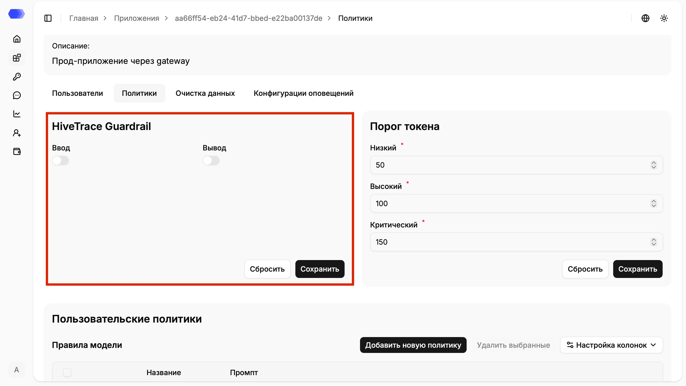
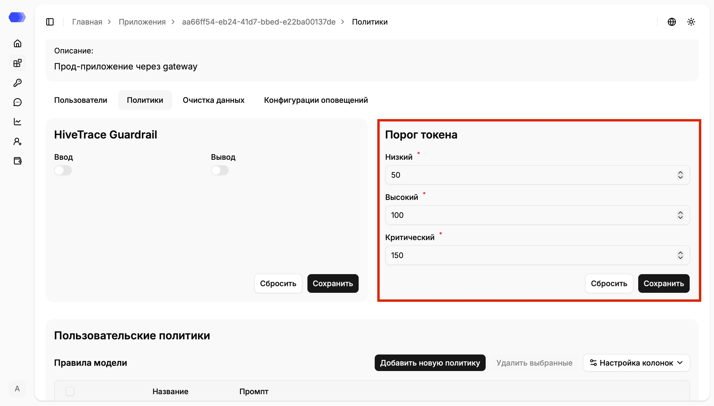
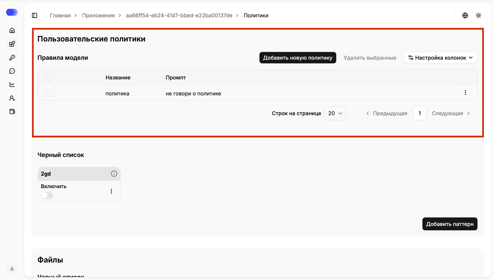
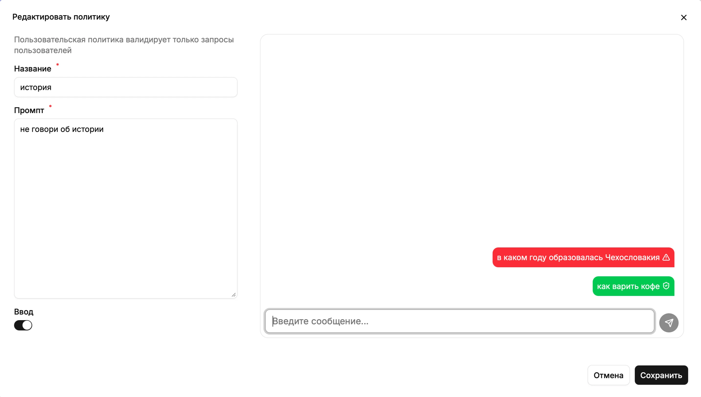
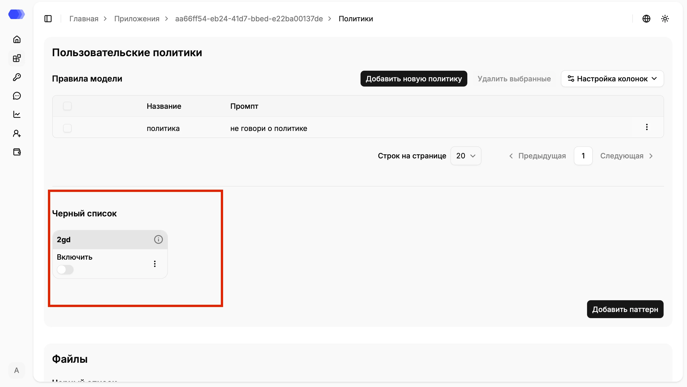
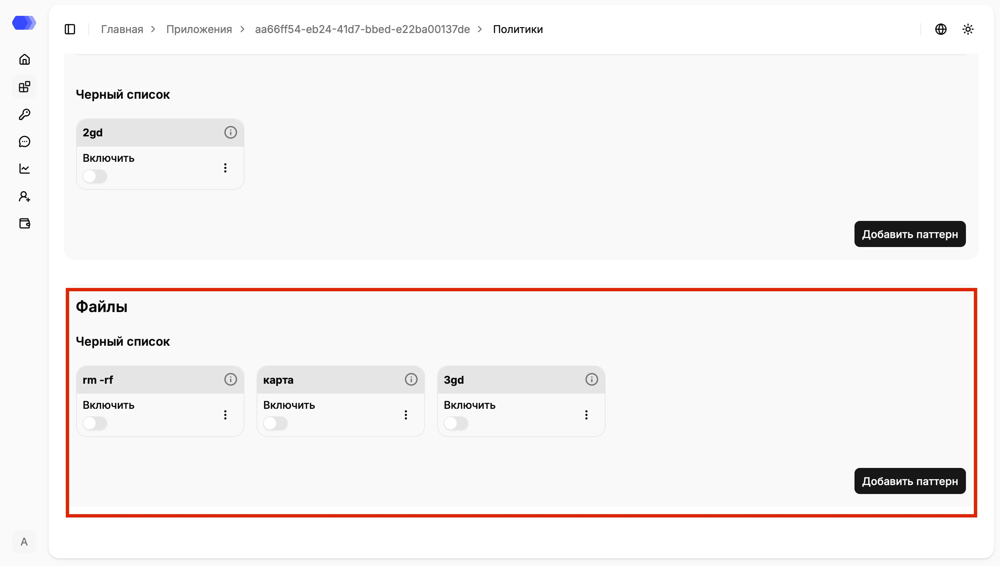
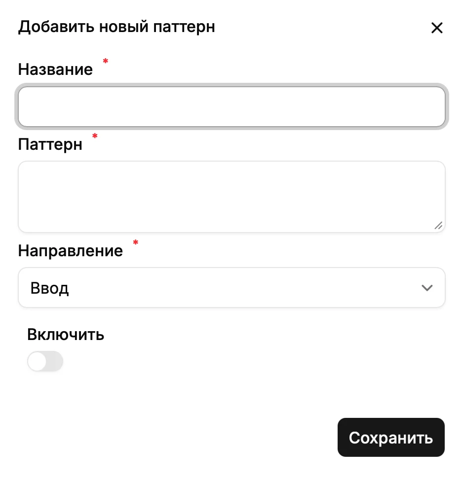

Policies are configured separately for each application. They let you enable the built-in HiveTrace protection, define threat thresholds, create custom rules for user requests, and check messages or files against blacklists.

## Open policy settings

1. Select **Applications** in the sidebar.
2. Open an application by clicking its ID.
3. Select the **Policies** tab.

The page contains HiveTrace Guardrail settings, token thresholds, custom policies, and message and file blacklists.

## HiveTrace Guardrail

HiveTrace Guardrail provides built-in protection against unsafe requests. Enable checks independently for each direction:

- **Input** checks messages sent from the user to the model.
- **Output** checks model responses before they are returned to the user.

Select **Save** to apply changes. **Reset** discards unsaved changes and restores the last saved values.

## Token thresholds

Token thresholds map a check result to a threat level. Set all three required values:

- **Low** is the first trigger boundary.
- **High** is the elevated-risk boundary.
- **Critical** is the critical-risk boundary.

Values must be ascending: Low must be less than High, and High must be less than Critical. Select **Save** to apply the values or **Reset** to discard unsaved changes.

## Custom policies

A custom policy validates user requests using an instruction prompt. The **Model rules** table displays the name and prompt of every policy.

Available actions:

- **Add new policy** opens the policy form.
- A row checkbox selects a policy; the header checkbox selects all visible rows.
- **Delete selected** removes the selected policies and is enabled after at least one row is selected.
- **Column settings** controls which table columns are visible.
- The row **⋮** menu edits or deletes one policy.
- **Rows per page**, **Previous**, and **Next** control pagination.

### Create, edit, and test a policy

Select **Add new policy**, or choose Edit from a row's **⋮** menu. Complete these fields:

1. **Name** — a clear, unique rule name.
2. **Prompt** — the instruction used to validate user requests.
3. **Input** — enables the policy for incoming messages.

Use the test panel on the right to enter a sample request and send it:

- a red message with a warning icon means the policy detected a violation;
- a green message with a shield means the request passed validation.

Test both prohibited and acceptable wording. Select **Save** when finished; **Cancel** closes the form without saving.

## Message blacklist

Patterns in this section are applied to message text. Each card contains the pattern name, an **Enable** switch, an information button, and a **⋮** menu for editing or deletion.

Select **Add pattern** to create a rule. A disabled pattern remains saved but is not used during checks.

## File blacklist

The **Files → Blacklist** section works in the same way, but applies its patterns to the contents of files attached to a request. Individual rules can be enabled or disabled, inspected, edited, or deleted.

## Add a pattern

Select **Add pattern** in the appropriate section and complete the form:

1. **Name** — the label displayed in the list.
2. **Pattern** — a regular expression or another supported pattern expression.
3. **Direction** — **Input** for user requests or **Output** for model responses.
4. **Enable** — activates the rule immediately after creation.
5. **Save** — creates the pattern. The **×** button closes the form without saving.

Test the expression on representative data before enabling it. An overly broad pattern can cause false positives.

## Verify the result

After saving the settings, send a test request through the connected application. To inspect triggers, open the record in **Session Analytics**, then use the **Censors**, **Data cleaning**, or **Validation configuration** tabs. With a synchronous protected integration, a detected violation can also block the request.
