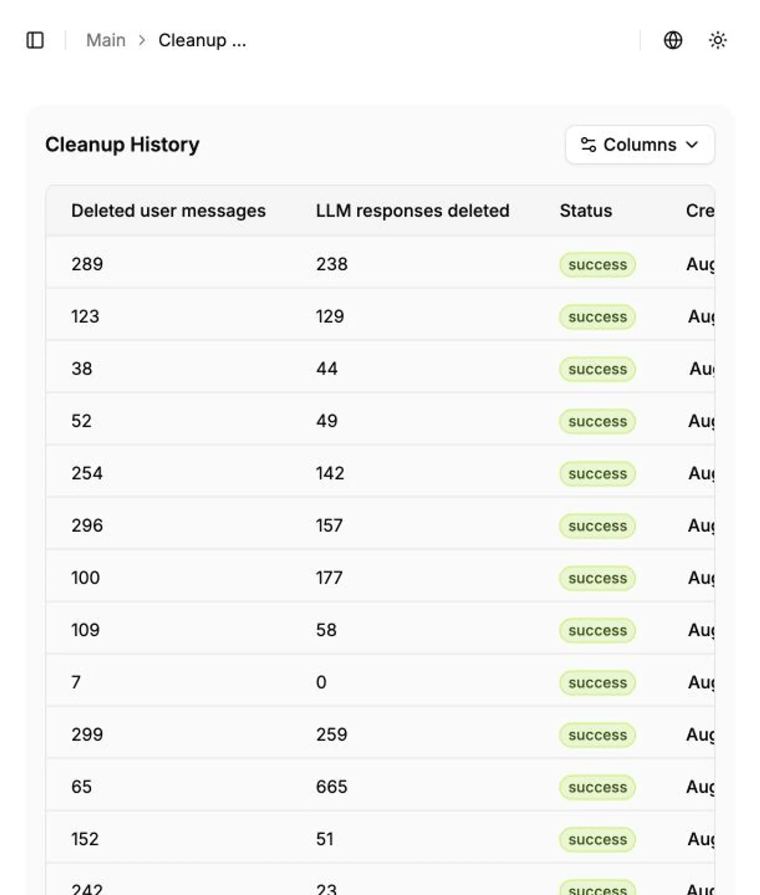

**Cleanup history** shows the outcome of background message-deletion jobs. Use it to confirm that a job has finished and to check how many user messages and LLM responses were removed.

## Opening the page

Follow the link in a cleanup notification. An administrator can also open `/cleanup-history` directly.

## Table fields

- **User messages deleted** — number of deleted user prompts.
- **LLM responses deleted** — number of deleted model responses.
- **Status** — current state of the background job. Counters may change while it is running.
- **Created at** — date and time when the job started.
- **Pagination** — opens another history page when the table contains more jobs than one page can display.

## Verifying a cleanup

1. Locate the latest job by its creation time.
2. Wait for it to finish; do not start a duplicate cleanup while it is running.
3. Compare both counters with the expected data volume. The values can differ because a session does not necessarily contain equal numbers of prompts and responses.
4. If the job fails, record its start time and ask the platform administrator to inspect backend and ClickHouse logs.

Cleanup history contains aggregated results and cannot restore deleted messages.

## Конфигурации оповещений

Конфигурация оповещений определяет, куда HiveTrace отправляет уведомления выбранного приложения и на каком языке формируется сообщение. Откройте **Приложения**, выберите нужное приложение и перейдите на вкладку **Конфигурации оповещений**.

На странице отображается таблица созданных каналов:

- **ID** — уникальный идентификатор конфигурации.
- **Название** — понятное имя канала.
- **Активен** — текущее состояние конфигурации.
- **Тип канала** — Email или Telegram.
- **Токен бота** и **ID чата** — параметры Telegram; для Email эти колонки остаются пустыми.
- **Email** — адрес получателя для конфигурации Email.
- **Обновлен** — дата последнего изменения.
- Кнопка **Настройка колонок** позволяет выбрать видимые столбцы таблицы.
- Меню **⋮** в строке открывает действия, доступные для этой конфигурации в текущей версии и для вашей роли.
- Внизу таблицы можно изменить число строк на странице и перейти между страницами.

### Создание Email-конфигурации

1. Нажмите **Добавить новую конфигурацию**.
2. Выберите вкладку **Email**.
3. Выберите язык уведомлений: **English** или **Русский**.
4. В поле **Название** укажите имя, по которому канал будет легко найти в таблице.
5. В поле **Email** укажите адрес получателя.
6. Нажмите **Добавить**.

Поля, отмеченные звездочкой, обязательны. После добавления конфигурация появляется в таблице; проверьте ее статус и адрес получателя.

### Создание Telegram-конфигурации

1. Нажмите **Добавить новую конфигурацию** и выберите вкладку **Telegram**.
2. Выберите язык уведомлений.
3. Заполните **Название**.
4. Укажите **Токен бота**, полученный для Telegram-бота.
5. Укажите **ID чата**, в который должны приходить уведомления.
6. Нажмите **Добавить**.

Не публикуйте токен Telegram-бота и не передавайте его в открытых каналах. Если токен был раскрыт, перевыпустите его и обновите конфигурацию.
