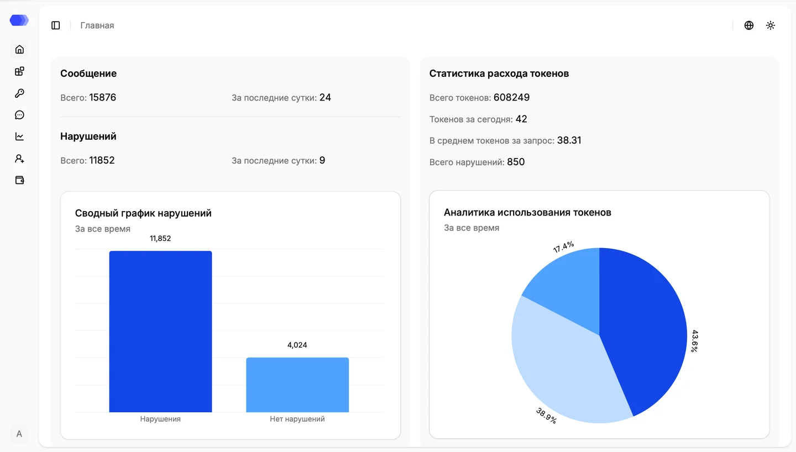
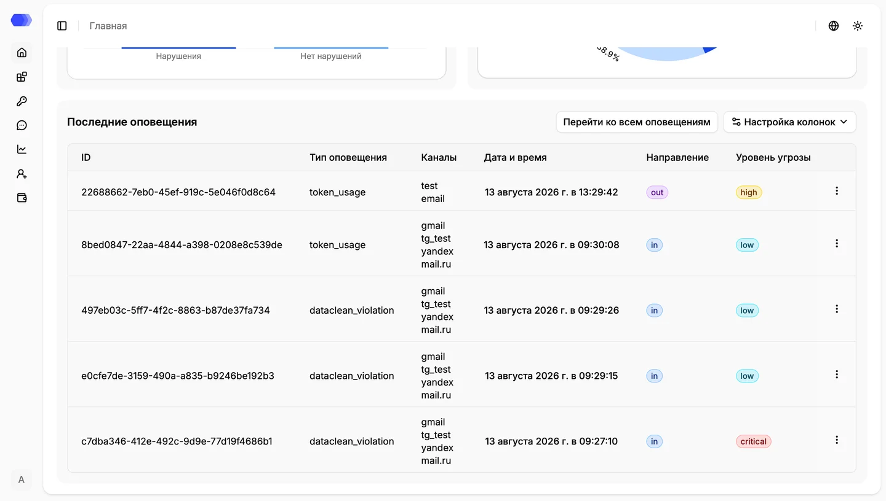

The **Dashboard** opens after sign-in and summarises HiveTrace traffic. Message and token metrics update as new data arrives without requiring a page reload.

## Summary metrics and charts

### Messages

- **Total** — requests and responses recorded over all time.
- **In the last 24 hours** — messages received during the latest rolling 24-hour period.

If traffic is expected but the daily value does not change, check the API token, application, and integration method.

### Violations

- **Total** — messages for which at least one safety check triggered.
- **In the last 24 hours** — violating messages during the latest 24 hours.
- **Violation summary chart** — compares messages with and without violations.

The metric counts messages rather than triggered rules; one message can contain multiple violations. Hover over a bar for its category and exact count. The chart period is fixed to **All time** in version 4.3.

### Token consumption statistics

- **Total tokens** — total recorded token consumption.
- **Tokens today** — consumption since the start of the current calendar day.
- **Average tokens per request** — average consumption per request.
- **Total violations** — number of token-threshold violations.
- **Token usage analytics** — percentage distribution of `low`, `high`, and `critical` violations.

The pie chart shows violation severities, not the ratio of prompt to completion tokens. Hover over a segment for its severity and share. Its period is fixed to **All time** in version 4.3.

## Latest alerts

- **ID** — unique alert identifier.
- **Alert type** — trigger, such as token usage or a DataClean violation.
- **Channels** — configurations through which the notification was sent.
- **Date and time** — creation time.
- **Direction** — `in` for a user request or `out` for an LLM response.
- **Severity** — `low`, `high`, or `critical`.
- **Row menu** — actions for the selected alert.

**Go to all alerts** opens the complete alert log. **Column settings** hides or restores columns; it does not delete data or change alert configurations.

## Review workflow

1. Compare the latest 24-hour metrics with normal traffic.
2. Assess the share of violating messages.
3. Review token-violation severity distribution.
4. Inspect recent alerts, starting with `critical` and `high`.
5. Open the full alert log or session analytics for investigation.

Values in the screenshots are example dev-environment data and are not recommended thresholds.
