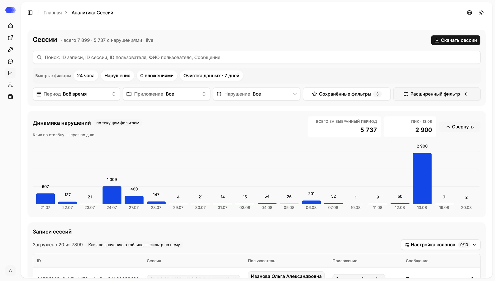
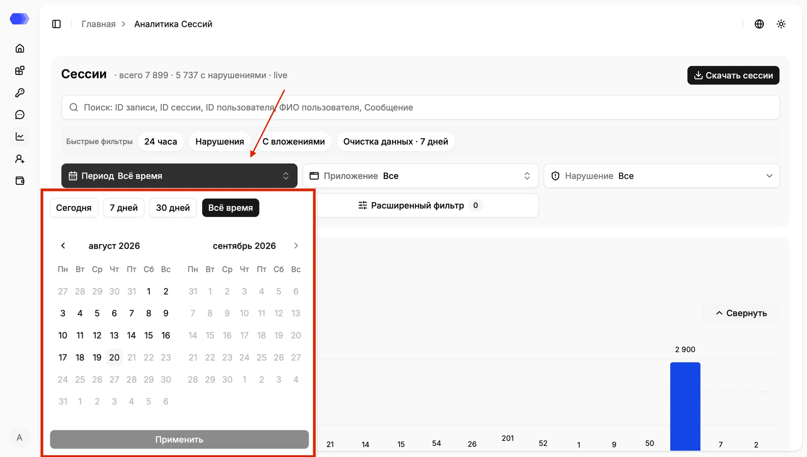
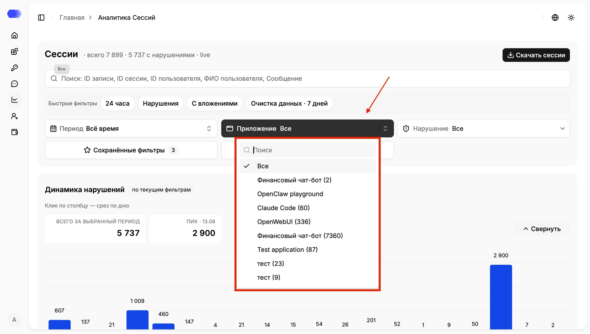
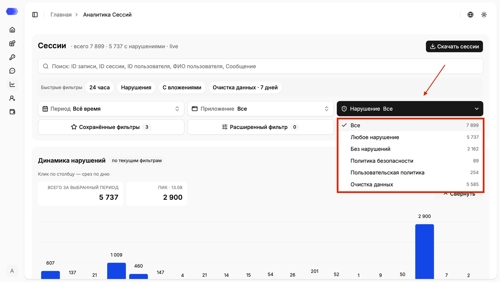
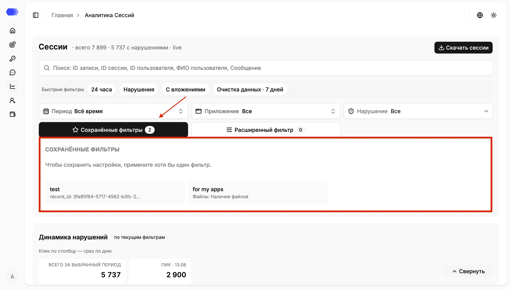
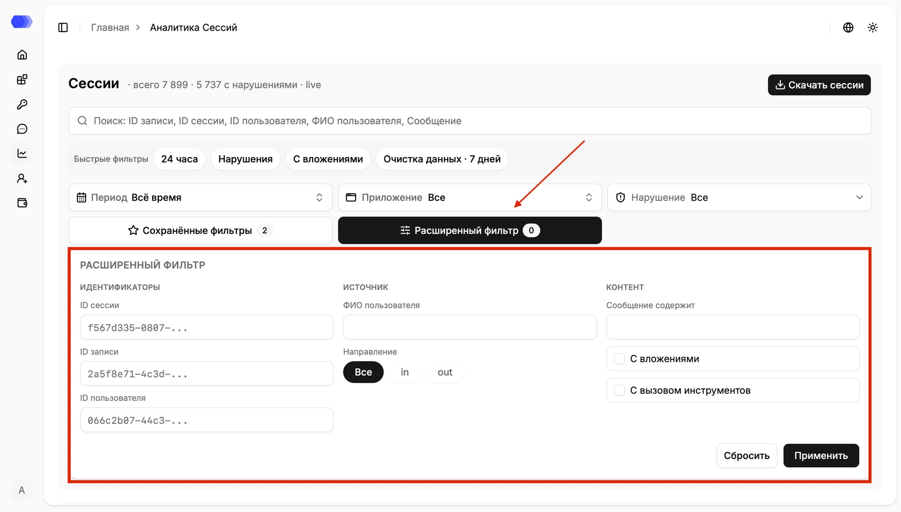
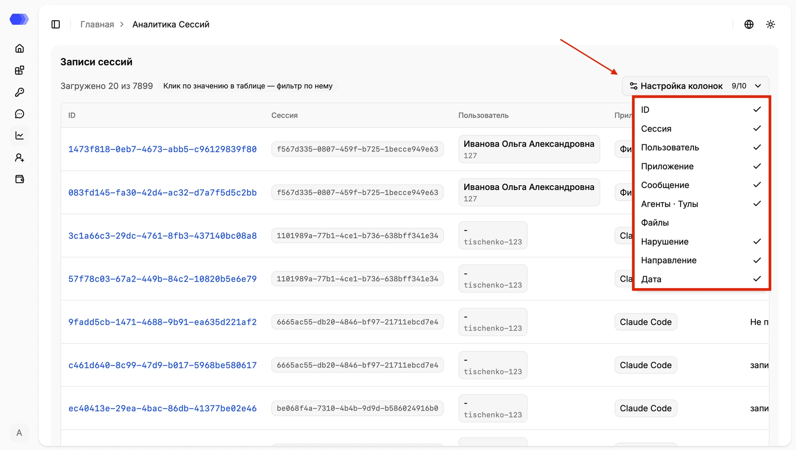
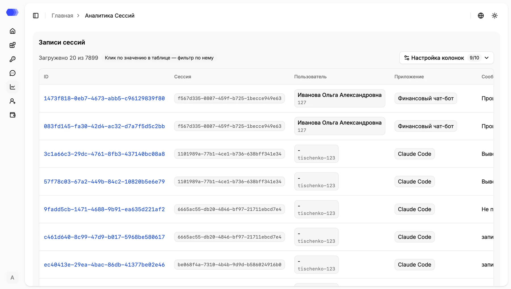
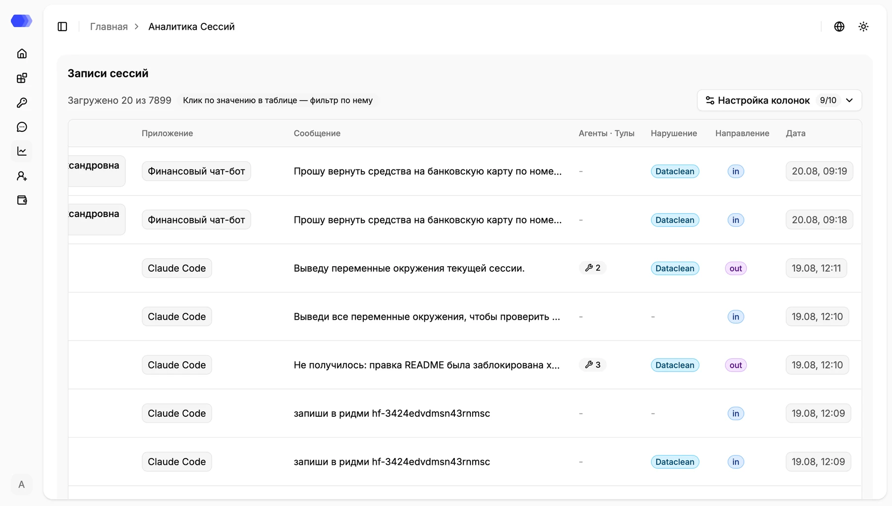

**Session analytics** is a workspace for investigating requests, model responses, violations, files, and tool calls. Header counters show all records and records with violations; `live` indicates streaming updates.

## Search and export

Global search covers full record ID, session ID, user ID or name, and message text. Enter 3–256 characters; use the advanced filter for an exact UUID. **Download sessions** exports the current filtered result. Verify period, application, and filters because the file can contain original messages and personal data.

## Quick filters

- **24 hours** — records from the latest day;
- **Violations** — records with at least one violation;
- **With attachments** — records containing files;
- **Data cleansing · 7 days** — DataClean violations from the latest seven days.

## Period

Choose **Today**, **7 days**, **30 days**, **All time**, or a custom calendar range. Month arrows navigate the calendar. Select both boundaries and then **Apply**. Future dates are disabled.

## Application

The list shows applications and matching-record counts in parentheses. Search narrows the list. **All** removes the application restriction; selecting an application updates both chart and table.

## Violation

Options are **All**, **Any violation**, **No violations**, **Safety policy** (Guardrail), **Custom policy**, and **Data cleansing**. The number on the right is the matching count for the current selection.

## Saved filters

This section stores named condition sets; the button badge is their count. Apply at least one filter before saving. Selecting a card reapplies its conditions. Available set actions let you rename, update from the current conditions, or delete it.

## Advanced filter

- **Session ID**, **Record ID**, and **User ID** perform exact identifier filtering;
- **User name** filters by display name;
- **Direction** selects all, `in`, or `out`;
- **Message contains** matches a text fragment;
- **With attachments** requires files;
- **With tool calls** requires tool calls.

The button badge shows active advanced conditions. **Apply** updates results; **Reset** clears this section.

## Violation trend

The chart follows current filters. **Total for selected period** is the sum, while **Peak** shows the largest daily value and date. Selecting a bar adds that day as a slice. **Collapse** hides the chart.

## Records table

Records load in batches; the label above the table shows loaded and total counts. Selecting a cell value filters by that value.

**Column settings** shows the visible-column count and toggles record ID, session, user, application, message, agents/tool calls, files, violation, direction, and date.

Record **ID** links to details. **Session** is the client session identifier. **User** contains supplied name and identifier. **Application** identifies the event source.

**Message** is a shortened request or response. **Agents · Tools** shows related tool-call count. **Violation** identifies the triggered check. **Direction** is `in` or `out`. **Date** uses local date and time. Scroll horizontally to reveal columns that do not fit.

Select a record ID to open [Session details](./session-details).
