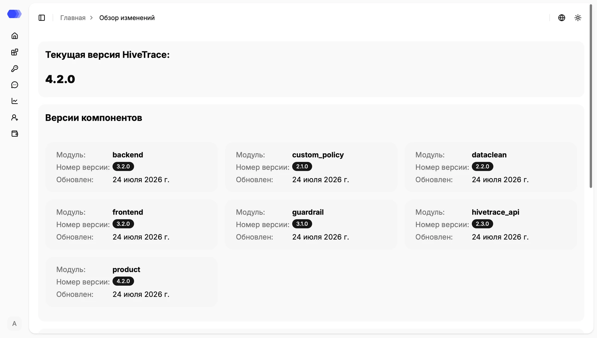
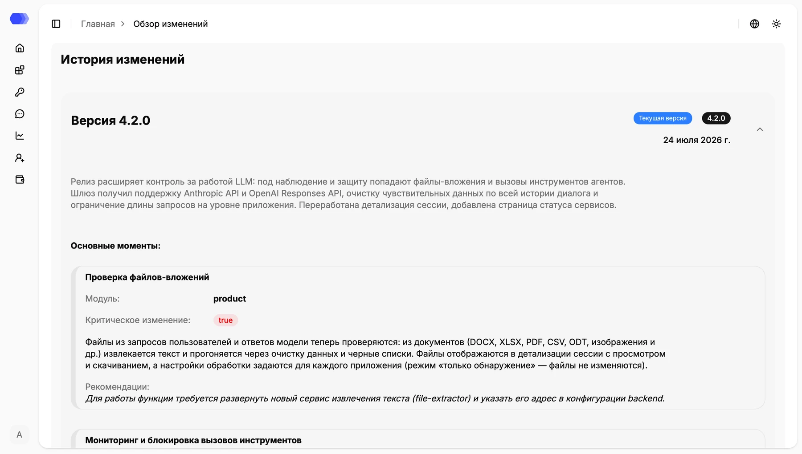

The **What's new?** page shows the installed HiveTrace version, component versions, and release history. Open it from the profile menu.

## Current version and components

Each component card shows the module name, version, and update date. Component versions can differ in a modular deployment. The screenshot reflects one environment and may not match your installation.

## Release history

Select a release header or its chevron to expand or collapse it. A card can contain a summary, affected module, critical-change flag, detailed behavior, and deployment recommendations. Review critical changes and recommendations before upgrading because they may require a new service, environment variable, or configuration change.
