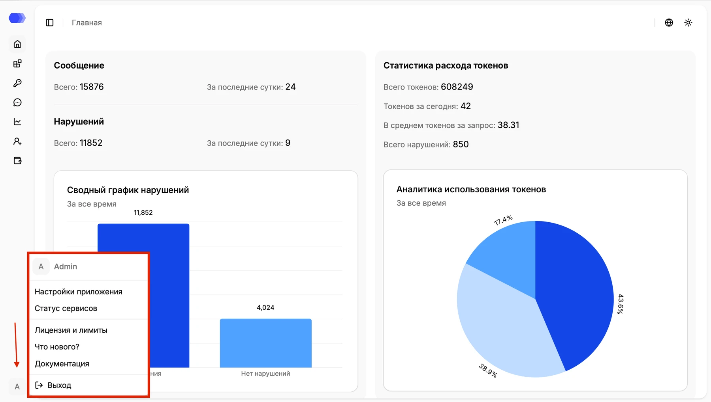

## Getting to Know HiveTrace Monitoring

HiveTrace Monitoring provides **continuous monitoring and protection** for AI applications, helping teams detect threats early, prevent attacks, and respond to incidents.

The platform analyzes inbound and outbound interactions **in real time**, complemented by **asynchronous checks** for deeper risk detection and ongoing policy improvement.

It also:

- offers centralized control for **multi-agent systems**;
- prevents **prompt injection** and **jailbreak** attacks;
- reduces the risk of **personal data leakage**;
- supports flexible **custom rules** and security policies.

## How It Works

HiveTrace Monitoring sits **between your application and the generative model**, adding a control layer to every interaction.

It analyzes user prompts and model outputs to identify:

- suspicious and unsafe scenarios;
- attempts to manipulate system behavior;
- transfer of sensitive data (PII/confidential information).

This approach helps prevent unsafe outcomes **before they affect business processes**, supports internal policy enforcement, and improves the predictability of AI services with minimal changes to your existing architecture.

## Platform menu

Use the icons in the left navigation to open the main workspace areas. The additional platform menu is in the lower-left corner: click the avatar containing the current user's initial.

The menu header shows the current user's avatar and name. The following destinations appear below it:

| Item | Destination |
| --- | --- |
| [**Application settings**](../guides/hivetrace-monitoring/platform-settings/) | Global monitoring and protection module settings |
| [**Service status**](../guides/hivetrace-monitoring/service-status/) | Platform component health and service availability |
| [**License and limits**](../guides/hivetrace-monitoring/license-limits/) | Active license information and available limits |
| [**What's new?**](../guides/hivetrace-monitoring/whats-new/) | Changes and capabilities introduced in recent releases |
| **Documentation** | HiveTrace user documentation, opened in a separate tab |
| **Sign out** | Ends the current session and returns to the sign-in page |

Click an item to open its destination. Save unfinished form changes before selecting **Sign out**, because signing out ends the authenticated session.
