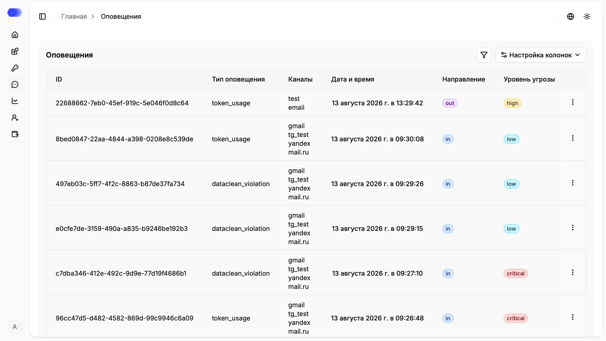

Страница **«Оповещения»** содержит полный список всех событий и уведомлений, формируемых системой HiveTrace. Оповещения могут дублироваться во внешние каналы доставки — **электронную почту**, **Telegram**, а также передаваться в **SIEM-систему** при наличии соответствующей интеграции.

Основным элементом страницы является таблица с информацией об оповещениях.

## Столбцы таблицы

| Поле           | Описание                                                                     |
| -------------- | ---------------------------------------------------------------------------- |
| ID             | Уникальный идентификатор оповещения                                          |
| Тип оповещения | Категория события или инцидента                                              |
| Каналы         | Названия конфигураций, через которые отправлялось уведомление                 |
| Дата и время   | Время формирования оповещения                                                |
| Направление    | Направление события — **in** (входящее сообщение) или **out** (ответ модели) |
| Уровень угрозы | Уровень критичности оповещения: **Low**, **High**, **Critical**              |

> **Примечание:** если для приложения не настроен ни один канал оповещений, поле **«Каналы»** будет пустым. При этом оповещение сохраняется в системе и остаётся доступным для просмотра на данной странице.

Типы `token_usage` и `dataclean_violation` на снимке являются примерами. Фактическое значение соответствует проверке или порогу, создавшему оповещение.

## Фильтры

Нажмите кнопку с воронкой над таблицей. В панели доступны:

- **ID сессии** — точный идентификатор сессии;
- **ID пользователя** — внутренний идентификатор пользователя;
- **Приложение** — выбор приложения из списка;
- **Тип оповещения** — строковое имя события;
- **Тип канала** — `E-mail` или `Telegram`;
- **Название канала** — имя конкретной конфигурации доставки;
- **Уровень угрозы** — `low`, `high` или `critical`;
- **Направление** — `in` или `out`;
- **Дата** — диапазон дат, не позднее текущего дня.

Применение фильтров обновляет параметры адреса страницы. Кнопка сброса очищает все условия. Несколько заполненных полей применяются совместно, поэтому слишком узкий набор может вернуть пустую таблицу.

## Настройка таблицы

**«Настройка колонок»** скрывает и возвращает столбцы, не удаляя данные. Пагинация внизу страницы позволяет выбрать число строк и перейти к предыдущей или следующей странице результатов.

## Переход к деталям инцидента

Для каждой записи в таблице доступно контекстное меню (иконка **трёх точек**). С его помощью можно перейти к подробной информации о событии.

Выберите **«Список сессий»**, чтобы перейти к сессиям пользователя, связанного с оповещением. Если у события нет `user_id`, действие недоступно.

Это позволяет быстро восстановить контекст инцидента, проанализировать цепочку взаимодействий и определить причину срабатывания политики или установленного порога.

Раздел **«Оповещения»** обеспечивает централизованную видимость событий безопасности, упрощает расследование инцидентов и помогает своевременно реагировать на потенциальные угрозы.
