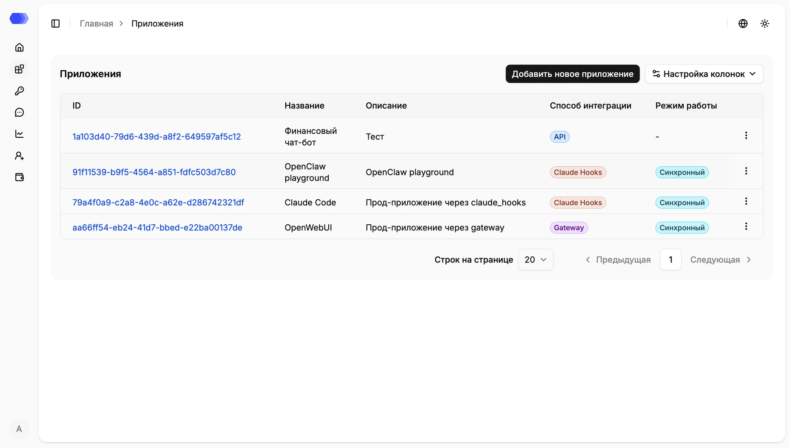
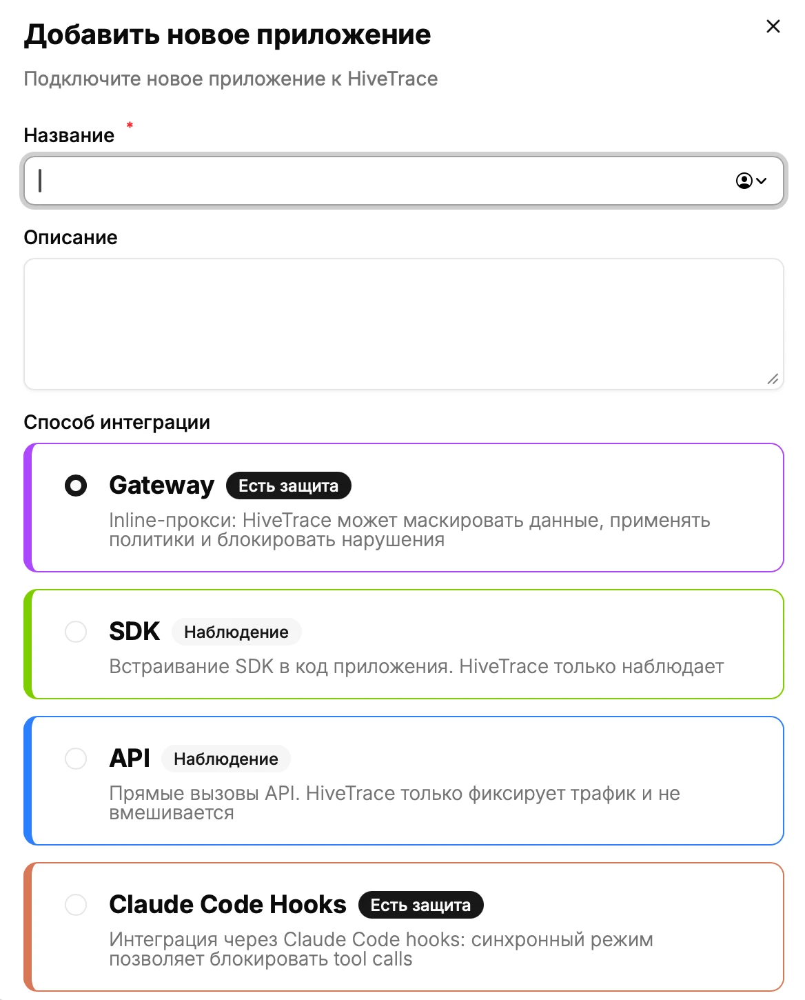
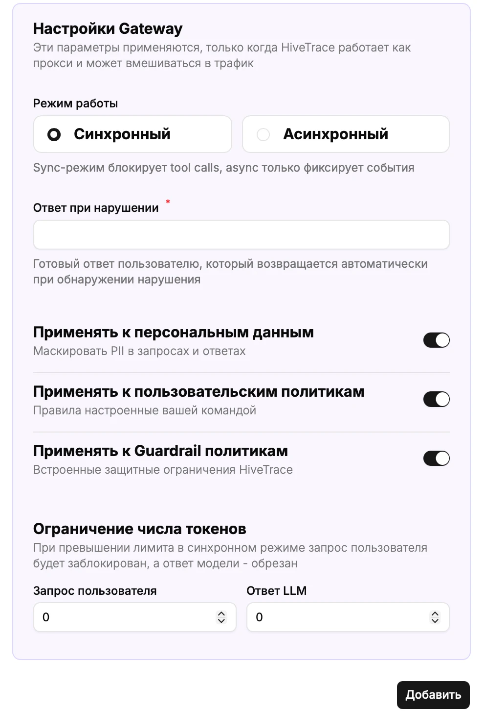
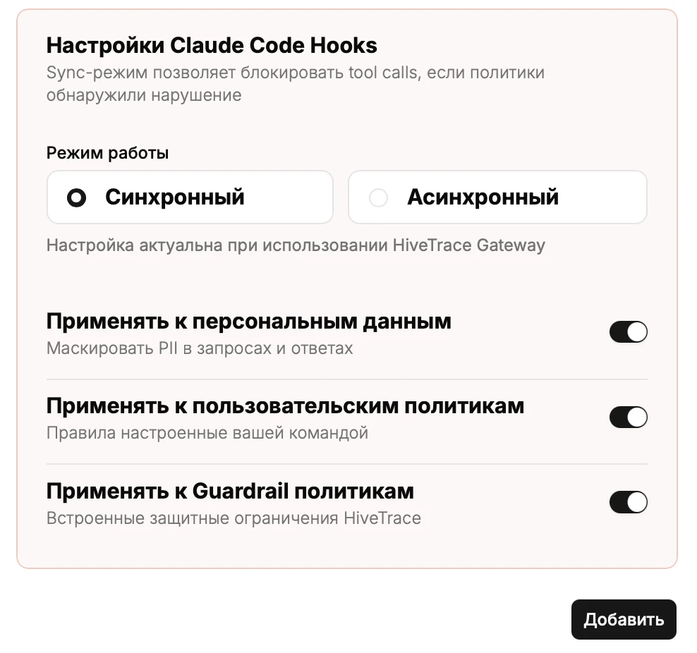

Раздел **«Приложения»** содержит AI-приложения, подключённые к HiveTrace. Для каждого приложения задаются способ интеграции, режим работы, проверки безопасности и ограничения трафика.

## Таблица приложений

Откройте пункт **«Приложения»** в основном меню. Над таблицей находится кнопка **«Добавить новое приложение»**, а под таблицей — пагинация.

- **ID** — уникальный идентификатор и ссылка на карточку приложения.
- **Название** — имя приложения; полный длинный текст показывается при наведении.
- **Описание** — назначение приложения.
- **Способ интеграции** — `Gateway`, `SDK`, `API` или `Claude Hooks`.
- **Режим работы** — синхронный, асинхронный или `—`, если настройка не применяется.
- **Меню действий** — редактирование и удаление приложения.

Нажмите ID, чтобы открыть пользователей и административные настройки приложения. Пагинация изменяет только отображаемую часть списка.

Кнопка **«Настройка колонок»** скрывает или возвращает выбранные столбцы. Список **«Строк на странице»** задаёт размер страницы, а кнопки **«Предыдущая»** и **«Следующая»** переключают страницы. Три точки в конце строки открывают меню редактирования и удаления.

## Создание приложения

Нажмите **«Добавить новое приложение»** и заполните форму.

Поля формы:

- **Название** — обязательное отображаемое имя, не более 256 символов;
- **Описание** — необязательный текст, не более 1500 символов;
- **Способ интеграции** — обязательный выбор Gateway, SDK, API или Claude Code Hooks.

Выбор интеграции сразу меняет нижнюю часть формы. Настройки Gateway и Claude Code Hooks сохраняются при переключении вариантов до закрытия окна. Нажмите **«Добавить»**. При ошибке форма останется открытой и покажет сообщение рядом с полем.

Варианты **Gateway** и **Claude Code Hooks** помечены как **«Есть защита»**: в синхронном режиме HiveTrace может вмешиваться в обработку. **SDK** и **API** помечены как **«Наблюдение»** и только передают данные для регистрации и анализа.

### Gateway

Gateway пропускает запросы к модели через HiveTrace и может остановить небезопасный запрос до его выполнения.

Для Gateway доступны:

- **Синхронный режим** — проверки выполняются до передачи запроса; при выборе появляются остальные параметры Gateway;
- **Асинхронный режим** — анализ не блокирует основной запрос, а зависимые поля скрываются;
- **Ответ при нарушении** — обязательная фраза вместо заблокированного результата;
- переключатели **DataClean**, **Пользовательские политики** и **Guardrail**;
- лимиты токенов для запроса пользователя и ответа LLM.

Ответ при нарушении обязателен только для синхронного Gateway. Значение должно содержать хотя бы один непробельный символ.

Положение переключателя справа показывает, будет ли выполняться соответствующая проверка. Значение `0` в полях ограничения токенов означает отсутствие заданного положительного порога; при использовании ограничения укажите значение больше нуля.

### SDK и API

Эти варианты предназначены для наблюдаемости через клиентскую библиотеку или вызовы API. Дополнительных полей в форме для них нет. Настройки задаются в карточке приложения и могут быть переопределены через Override API.

### Claude Code Hooks

Этот способ позволяет проверять действия Claude Code, включая вызовы инструментов. В синхронном режиме отображаются переключатели DataClean, пользовательских политик и Guardrail. Ответ при нарушении и лимиты токенов для Claude Code Hooks не показываются.

Кнопка **«Добавить»** сохраняет приложение со всеми выбранными параметрами. Крестик в правом верхнем углу закрывает форму без создания приложения.

## Редактирование приложения

1. Откройте меню действий в строке приложения.
2. Нажмите **«Редактировать»**.
3. Измените поля и зависимые настройки.
4. Нажмите **«Сохранить»**.

ID не редактируется. Изменения применяются к последующей обработке; конфигурация уже записанной сессии сохраняется в её детализации.

## Удаление приложения

1. Откройте меню действий и нажмите **«Удалить»**.
2. Проверьте выбранное приложение в окне подтверждения.
3. Подтвердите удаление.

Удаление необратимо. Сначала убедитесь, что интеграционный трафик остановлен или перенаправлен и связанные API-токены больше не используются.

## Карточка приложения

Откройте приложение по его ID. В карточке отображаются название, описание и доступные разделы:

- **Пользователи** — пользователи, взаимодействовавшие с приложением;
- **Политики** — Guardrail, пользовательские политики, чёрные списки сообщений и файлов;
- **Очистка данных** — встроенные и пользовательские паттерны, белые списки, способы и глубина обработки;
- **Конфигурации оповещений** — каналы доставки уведомлений.

Разделы управления политиками, очисткой данных и оповещениями доступны только администратору. Устаревшие разделы **«Агенты»** и **«Трассировка»** удалены; для анализа агентных сценариев используйте вкладку **«Вызовы инструментов»** в детализации сессии.

## Обработка файлов

Для приложения можно настроить проверку файлов из запросов и ответов. HiveTrace извлекает текст из поддерживаемых документов и применяет DataClean и чёрные списки.

Доступны отдельные настройки для входящих и исходящих файлов, ограничения размера и количества изображений, а также режим обнаружения без изменения исходного файла. Фактическая обработка зависит от доступности сервиса `file-extractor`.

## Рекомендации

- Используйте отдельное приложение для каждого независимого продукта или окружения.
- Не переиспользуйте API-токены между приложениями.
- После изменения политик проверяйте конфигурацию встроенными инструментами тестирования.
- Для расследования учитывайте конфигурацию, сохранённую в конкретной сессии: она не меняется задним числом при редактировании приложения.
