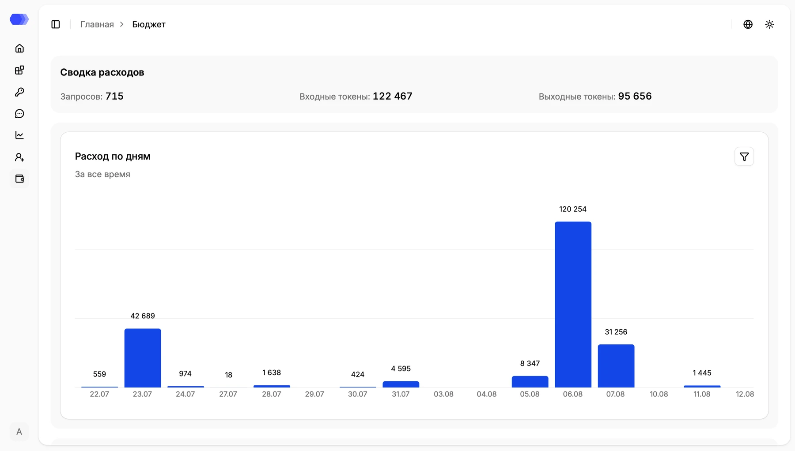
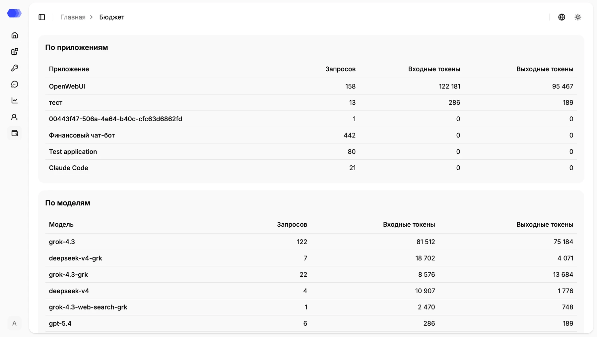
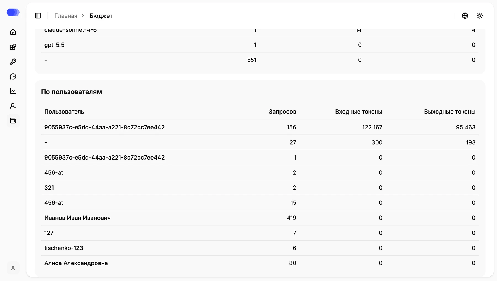

Страница **«Бюджет»** показывает нагрузку на LLM в запросах и токенах. Раздел доступен только администратору и помогает определить, какое приложение, модель или пользователь создаёт основную нагрузку.

## Сводка расходов

В верхнем блоке показаны итоговые значения за выбранный период:

- **Запросов** — количество обработанных обращений к моделям;
- **Входные токены** — токены, переданные модели в запросах;
- **Выходные токены** — токены, полученные в ответах модели.

Блок **Расход по дням** показывает динамику потребления. Подзаголовок сообщает активный период, например **За всё время**, даты находятся на горизонтальной оси, а значение подписано над каждым столбцом. Дни без потребления могут отображаться без столбца.

Нажмите кнопку с воронкой в правом верхнем углу графика, чтобы открыть фильтры. Они ограничивают данные по диапазону дат и приложению. После применения обновляются сводка, график и все таблицы ниже; сброс возвращает данные за всё время.

## По приложениям и моделям

Таблица **По приложениям** помогает определить, какое подключение создает основную нагрузку. Для каждого приложения приводятся число запросов, входные и выходные токены. Если вместо понятного названия отображается идентификатор, запись была получена без доступного отображаемого имени приложения.

Таблица **По моделям** группирует те же показатели по имени модели, переданному интеграцией. Сравнивайте число запросов и объем токенов вместе: небольшое количество длинных запросов может потреблять больше токенов, чем большое количество коротких.

## По пользователям

Последняя таблица распределяет нагрузку между пользователями. В первой колонке может отображаться ФИО, внешний идентификатор или внутренний ID — то значение, которое было доступно при обработке. Дефис означает, что связать запросы с конкретным пользователем не удалось.

Во всех трех таблицах используются одинаковые показатели: **Запросов**, **Входные токены** и **Выходные токены**. Нулевое количество токенов при ненулевом числе запросов означает, что для этих записей токенная статистика не была передана или зафиксирована.

## Как анализировать нагрузку

1. Откройте фильтры блока **«Использование по дням»**.
2. Выберите начало и конец периода. При необходимости ограничьте выбор одним приложением.
3. Примените фильтры и проверьте период под заголовком графика.
4. Найдите дни с пиковыми значениями.
5. Используйте таблицы по приложениям, моделям и пользователям, чтобы определить источник нагрузки.

Пустая таблица означает отсутствие данных для выбранных условий. В версии 4.3 страница показывает потребление, но не рассчитывает денежную стоимость и не предоставляет экспорт.
