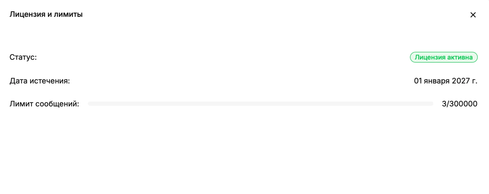

Окно **«Лицензия и лимиты»** показывает состояние лицензии и использование доступного объёма сообщений. Откройте его из меню профиля в левом нижнем углу.

В окне отображаются:

- **Статус** — активна ли лицензия;
- **Дата истечения** — дата окончания текущего периода лицензии;
- **Лимит сообщений** — отношение уже использованных сообщений к доступному количеству;
- полоса прогресса — визуальная доля использованного лимита.

Значения на снимке приведены как пример. Проверяйте актуальные дату и расход в своей среде. При приближении к лимиту заранее обратитесь к администратору или ответственному за лицензирование. Нажмите **×**, чтобы закрыть окно.
