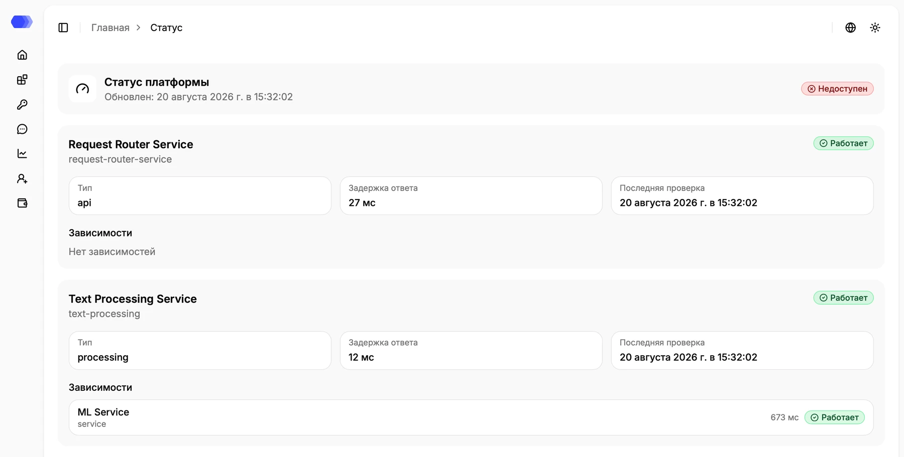
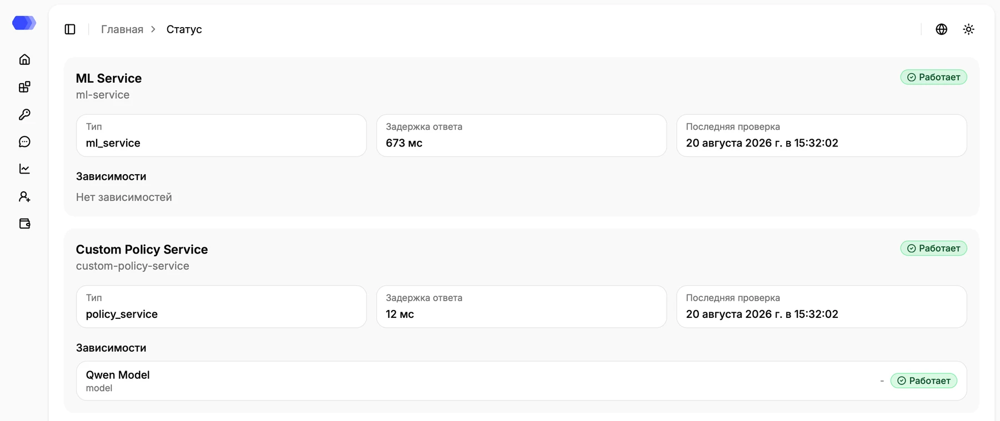
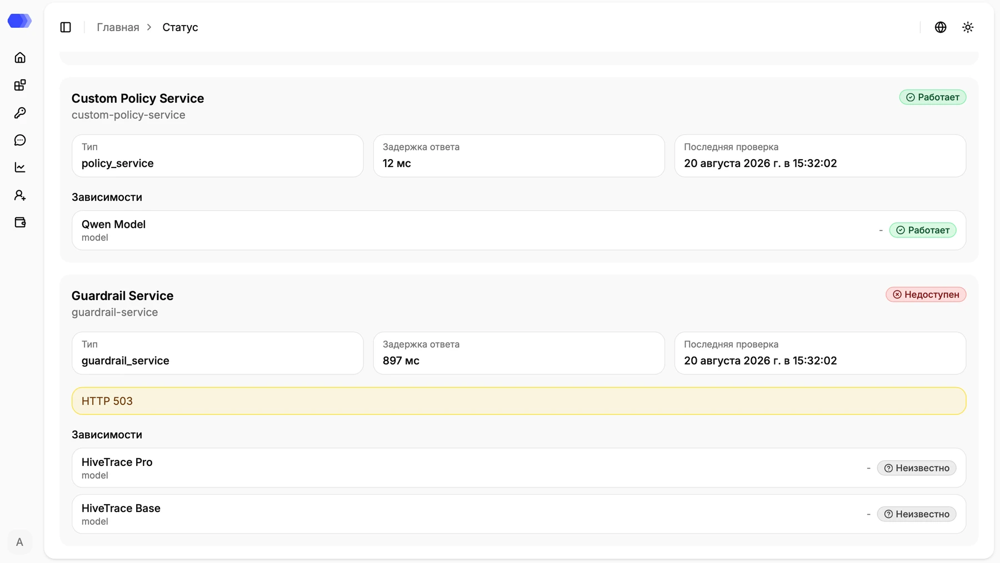

Страница **«Статус сервисов»** показывает доступность платформы, отдельных компонентов и их зависимостей. Она доступна администратору из меню профиля и предназначена для первичной диагностики.

## Сводный статус платформы

В верхнем блоке отображаются общий статус и время обновления. Общий статус учитывает состояние компонентов: если обязательный сервис недоступен, платформа может отображаться как недоступная, даже когда остальные компоненты работают.

Состояние на снимке — пример результата конкретной проверки. Ориентируйтесь на актуальный статус и время обновления в своей среде.

## Карточка сервиса

В каждой карточке указаны:

- название и статус сервиса;
- **Тип** — роль компонента в платформе;
- **Время ответа** — задержка последней проверки в миллисекундах; `—` означает, что значение не получено;
- **Последняя проверка** — время последнего результата мониторинга;
- текст ошибки — показывается при неуспешной проверке;
- **Зависимости** — вложенные компоненты и их собственные состояния.

Зависимость отображается внутри карточки родительского сервиса. Для неё показываются название, тип, время ответа и отдельный статус. Это помогает отличить ошибку самого сервиса от проблемы нижестоящей модели или другого компонента.

## Возможные состояния

- **Работает** — проверка выполнена успешно;
- **Деградирован** — сервис отвечает, но медленно или не полностью;
- **Недоступен** — проверка завершилась ошибкой;
- **Отключён** — компонент выключен конфигурацией и не считается инцидентом;
- **Неизвестно** — мониторинг пока не получил однозначный результат.

Например, `HTTP 503` означает, что проверяемый сервис временно не смог обработать запрос. Статус зависимости **«Неизвестно»** не подтверждает её отказ: он означает, что мониторинг не получил достаточных данных для однозначного результата.

## Что делать при ошибке

1. Проверьте время последней проверки: устаревшее значение может указывать на проблему самого мониторинга.
2. Раскройте зависимости проблемного сервиса и найдите нижестоящий компонент с ошибкой.
3. Сохраните текст ошибки и время проверки.
4. Для поиска причины перейдите к журналам и метрикам соответствующего сервиса. Кнопок перезапуска или изменения конфигурации на этой странице нет.
