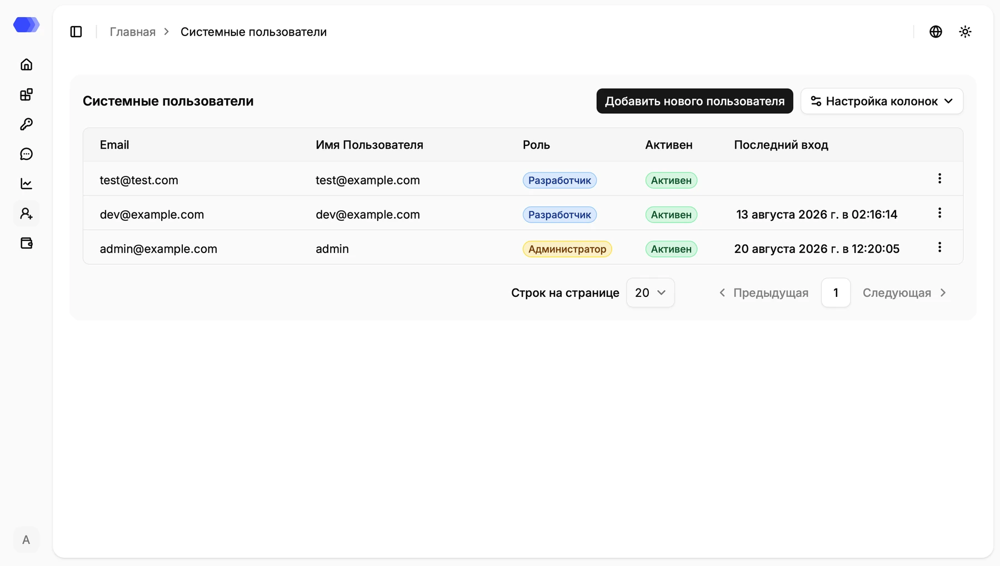
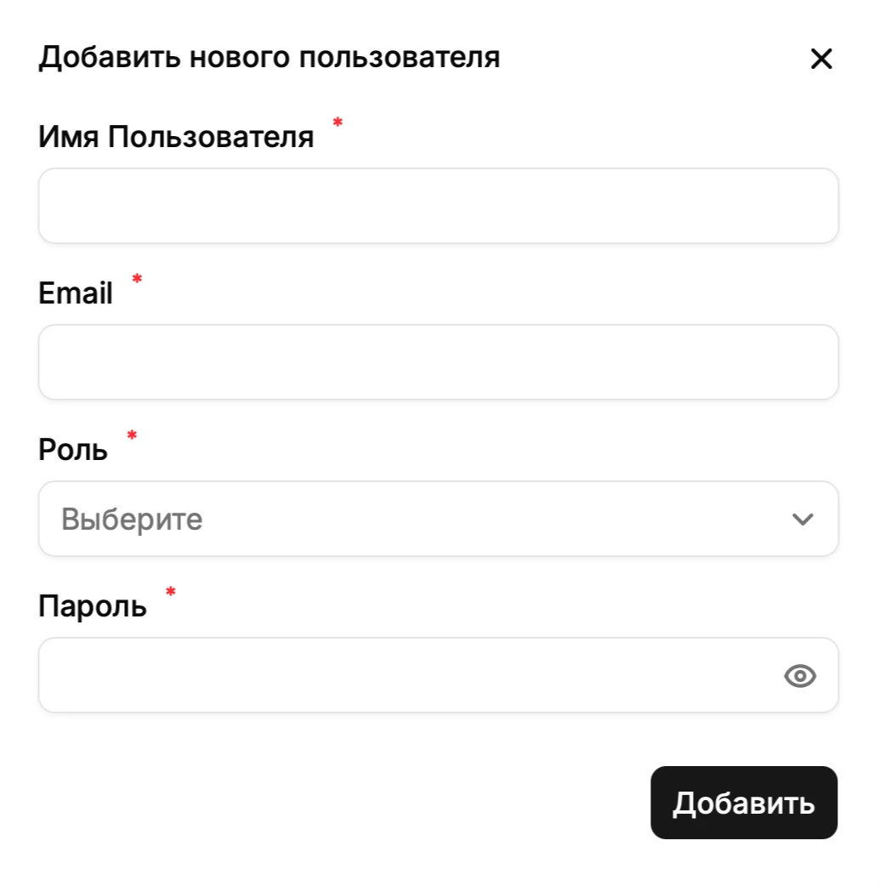

Раздел **Системные пользователи** предназначен для управления учетными записями сотрудников, которые входят в административную панель HiveTrace. Откройте его по значку пользователя с плюсом в левом меню.

## Таблица пользователей

Каждая строка соответствует одной учетной записи. Таблица содержит следующие данные:

| Колонка | Описание |
| --- | --- |
| **Email** | Адрес, который пользователь указывает при входе |
| **Имя пользователя** | Отображаемое имя учетной записи |
| **Роль** | Набор доступных пользователю возможностей, например **Администратор** или **Разработчик** |
| **Активен** | Текущее состояние учетной записи |
| **Последний вход** | Дата и время последней успешной авторизации; поле остается пустым, если входов еще не было |

Нажмите **Настройка колонок**, чтобы показать или скрыть доступные поля таблицы. Меню **⋮** в конце строки открывает действия с выбранной учетной записью; состав действий зависит от прав текущего администратора и состояния пользователя.

В нижней части таблицы можно выбрать число строк на странице и перейти на предыдущую или следующую страницу. Недоступная кнопка навигации отображается серым.

## Добавление пользователя

1. Нажмите **Добавить нового пользователя**.
2. Заполните обязательные поля формы.
3. Проверьте выбранную роль и пароль.
4. Нажмите **Добавить**.

Поля формы:

| Поле | Назначение |
| --- | --- |
| **Имя пользователя** | Имя, которое будет отображаться в интерфейсе |
| **Email** | Уникальный адрес для авторизации |
| **Роль** | Определяет доступные разделы и операции |
| **Пароль** | Начальный пароль новой учетной записи |

Все поля отмечены звездочкой и обязательны. В поле **Роль** нажмите стрелку и выберите подходящий вариант. Значок глаза в поле **Пароль** показывает или скрывает введенное значение. Кнопка **×** закрывает форму без создания пользователя.

После успешного добавления новая учетная запись появляется в таблице. Передавайте пароль пользователю по защищенному каналу и назначайте только те права, которые требуются для его задач.

## Роли

- **Администратор** предназначен для управления и настройки HiveTrace, включая административные разделы.
- **Разработчик** предназначен для технических специалистов, которые подключают и сопровождают приложения.

Точный набор доступных действий может зависеть от конфигурации развертывания. Если пользователь не видит нужный раздел, сначала проверьте назначенную ему роль и статус учетной записи.
