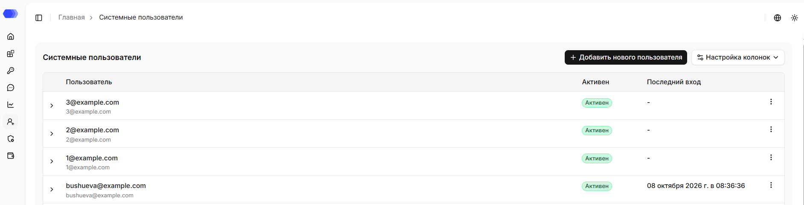
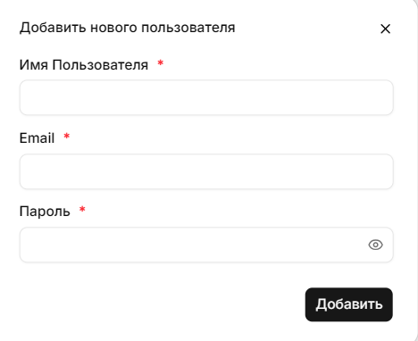
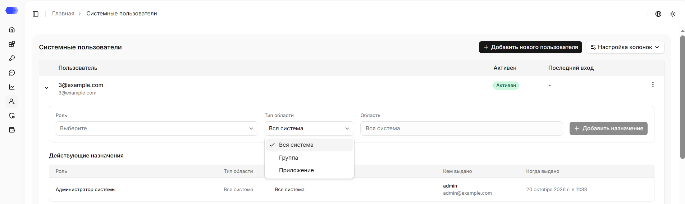
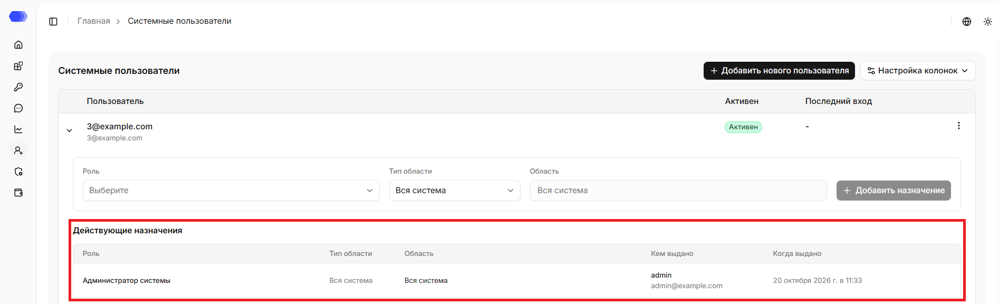

Раздел **Системные пользователи** используется для управления учетными записями, которые могут входить в интерфейс HiveTrace, и для назначения им ролей. Откройте его по значку пользователя с плюсом в боковом меню.

## Таблица пользователей

Каждая строка соответствует одной учетной записи. Таблица содержит следующие данные:

| Колонка | Описание |
| --- | --- |
| **Пользователь** | Имя и email системного пользователя |
| **Активен** | Текущее состояние учетной записи |
| **Последний вход** | Дата и время последней успешной авторизации; отображается дефис, если входов еще не было |

Нажмите **Настройка колонок**, чтобы показать или скрыть доступные поля таблицы. Меню **⋮** в конце строки открывает действия с выбранной учетной записью; состав действий зависит от прав текущего пользователя.

В нижней части таблицы можно выбрать число строк на странице и перейти на предыдущую или следующую страницу. Недоступная кнопка навигации отображается серым.

## Добавление пользователя

1. Нажмите **Добавить нового пользователя**.
2. Заполните обязательные поля формы.
3. Нажмите **Добавить**.

В форме добавления системного пользователя заполняются:

- `Имя Пользователя` - отображаемое имя учетной записи;
- `Email` - email для входа;
- `Пароль` - пароль для входа в систему.

Все поля отмечены звездочкой и обязательны. Значок глаза в поле **Пароль** показывает или скрывает введенное значение. Кнопка **×** закрывает форму без создания пользователя.

После успешного добавления новая учетная запись появляется в таблице. Сама по себе новая учетная запись еще не дает доступ к разделам интерфейса: для доступа нужно назначить роль. Благодаря роли пользователь получает доступ к нужным действиям в пределах своей области действия: роль задаёт, какие операции ему разрешены, а какие остаются недоступными.

## Назначить роль системному пользователю

1. Найдите учетную запись в списке системных пользователей.
2. Раскройте строку системного пользователя.
3. Выберите роль.
4. Выберите `Тип области`. Назначить роль можно на всю систему, на группу приложений или на определённое приложение. 
5. Выберите `Область`, если она требуется для выбранного типа области.
6. Нажмите `Добавить назначение`.

После сохранения системный пользователь получит права, описанные выбранной ролью, в выбранной области действия. При успешной выдаче назначения интерфейс показывает уведомление `Назначение выдано`. Если системный пользователь уже находится в системе, после изменения прав ему может потребоваться обновить страницу.

## Просмотреть действующие назначения системного пользователя

1. Найдите учетную запись.
2. Раскройте строку системного пользователя.
3. Посмотрите таблицу `Действующие назначения`.

В таблице видно, какие роли уже выданы системному пользователю, где они действуют, кто выдал назначение и когда оно было выдано. Если назначений нет, таблица покажет `Нет данных`.

У действующего назначения есть действие `Отозвать`. Оно удаляет назначение роли у системного пользователя. После отзыва права, которые были получены только через это назначение, перестают действовать.

## Рекомендации по настройке ролей

- Создавайте роли под реальные рабочие задачи, а не под конкретных людей.
- Не выдавайте полный доступ, если системному пользователю достаточно просмотра.
- Используйте группы приложений для команд, которые работают с одинаковым набором приложений.
- Проверяйте итоговые права системного пользователя после изменения ролей.
- Удаляйте или отключайте лишние назначения, если системный пользователь больше не должен иметь доступ.

## Доступ к странице

Для просмотра таблицы системных пользователей нужны права:

- Область **Операторы системы** — уровень доступа не ниже `«Чтение»`.

Для создания системных пользователей, их активации и деактивации нужны права:

- Область **Операторы системы** — уровень доступа не ниже `«Редактирование»`.

Для удаления системных пользователей нужны права:

- Область **Операторы системы** — `Полный` уровень доступа.

Для просмотра действующих назначений системных пользователей нужны права:

- Область **Операторы системы** — уровень доступа не ниже `«Чтение»`;
- Область **Роли и назначения** — уровень доступа не ниже `«Чтение»`.

Для назначения ролей системным пользователям и их отзыва нужны права:

- Область **Операторы системы** — уровень доступа не ниже `«Чтение»`;
- Область **Роли и назначения** — `Полный` уровень доступа.

Если у пользователя нет доступа для просмотра страницы, отображается страница `403 - Нет доступа`.
