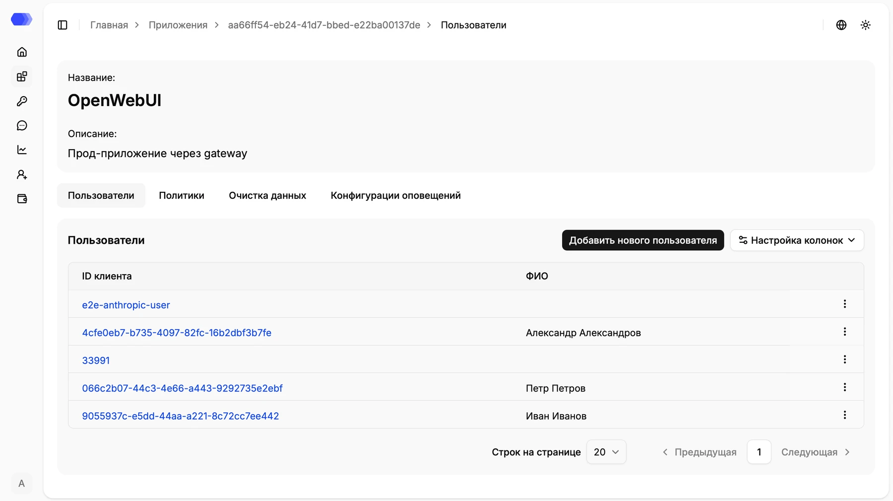
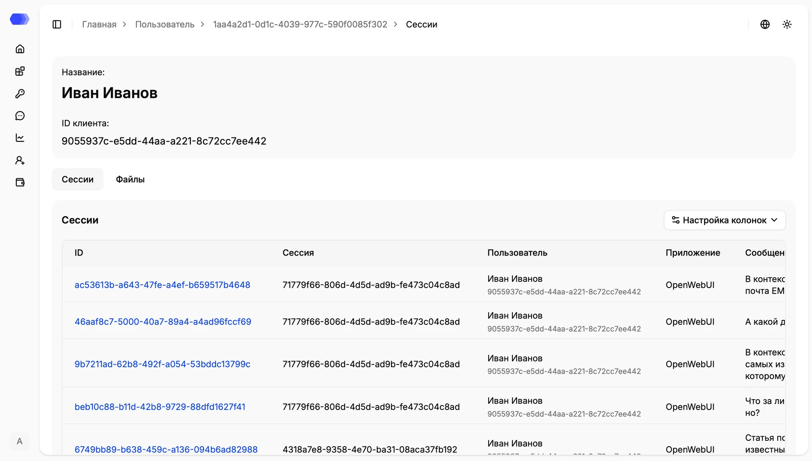

Раздел **«Пользователи»** показывает конечных пользователей выбранного AI-приложения и помогает перейти от пользователя к связанным с ним сессиям и файлам.

Чтобы открыть раздел, перейдите в **«Приложения»**, нажмите идентификатор нужного приложения и выберите вкладку **«Пользователи»**.

В верхней части страницы отображаются название и описание приложения. Ниже расположены вкладки **«Пользователи»**, **«Политики»**, **«Очистка данных»** и **«Конфигурации оповещений»**.

## Таблица пользователей

В таблице доступны следующие данные:

- **ID клиента** — уникальный идентификатор пользователя. Синий идентификатор является ссылкой на карточку пользователя;
- **ФИО** — отображаемое имя пользователя, если оно было передано или добавлено вручную.

Доступные действия:

1. Нажмите **«Добавить нового пользователя»**, чтобы создать пользователя вручную.
2. Откройте **«Настройка колонок»**, чтобы выбрать отображаемые столбцы.
3. Используйте меню **⋮** в строке пользователя для доступных действий с записью, включая редактирование и удаление.
4. В нижней части таблицы выберите число строк на странице или перейдите на другую страницу.
5. Нажмите синий **ID клиента**, чтобы открыть карточку пользователя.

## Автоматическое создание пользователей

Пользователь создается автоматически, если в запросе HiveTrace передан новый идентификатор:

- в дополнительных параметрах при использовании API или SDK;
- в HTTP-заголовках при работе через прокси.

Автоматически созданная запись может содержать только **ID клиента**. ФИО при необходимости добавляется через интерфейс.

## Карточка пользователя и сессии

После нажатия на **ID клиента** открывается карточка пользователя. В верхней части указаны имя и идентификатор клиента, а ниже расположены вкладки **«Сессии»** и **«Файлы»**.

На вкладке **«Сессии»** отображаются связанные с пользователем записи. Таблица содержит идентификатор записи и сессии, пользователя, приложение, сообщение и другие включенные колонки.

- Нажмите синий **ID записи**, чтобы открыть детализацию события.
- Используйте **«Настройка колонок»**, чтобы изменить состав таблицы.
- Выберите вкладку **«Файлы»**, чтобы просмотреть загруженные пользователем вложения.

## Файлы пользователя

На вкладке **«Файлы»** отображаются файлы, связанные с запросами пользователя. Для доступных форматов можно открыть предпросмотр или скачать исходный файл.

> **Важно:** обработка содержимого файлов зависит от глобальной настройки **«Пользовательская обработка файлов»** и конфигурации выбранного приложения. Если обработка отключена, наличие файла в этой вкладке само по себе не означает, что его содержимое было проверено политиками или очисткой данных.
